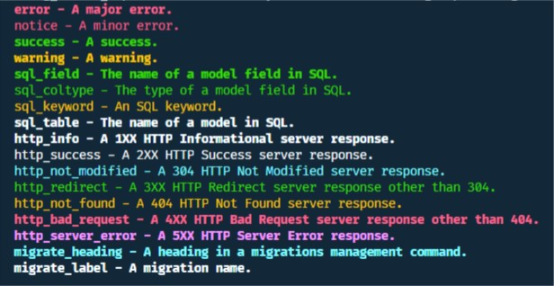

Usamos comandos de Django desde que comenzamos a crear un proyecto, una app o iniciamos el servidor de desarrollo. Probablemente los comandos para realizar estas operaciones (`startproject`, `startapp` y `runserver`) sean los más conocidos, pero existen muchos más y también podemos escribir nuestros propios comandos.

Podemos ver todos los comandos que existen por defecto en nuestro proyecto ejecutando el comando `python manage.py` sin argumentos o `python manage.py help`. Esta es la lista de todos los comandos disponibles:

```bash
python manage.py help

Type 'manage.py help <subcommand>' for help on a specific subcommand.

Available subcommands:

[auth]
    changepassword
    createsuperuser

[contenttypes]
    remove_stale_contenttypes

[django]
    check
    compilemessages
    createcachetable
    dbshell
    diffsettings
    dumpdata
    flush
    inspectdb
    loaddata
    makemessages
    makemigrations
    migrate
    sendtestemail
    shell
    showmigrations
    sqlflush
    sqlmigrate
    sqlsequencereset
    squashmigrations
    startapp
    startproject
    test
    testserver

[sessions]
    clearsessions

[staticfiles]
    collectstatic
    findstatic
    runserver
```

También podemos ver la ayuda de un comando específico: `python manage.py help <command>` donde `command` es el nombre del comando que deseas consultar.

## Cuándo crear un nuevo comando

Podemos escribir nuestros propios comandos y no existe límite de cuantos comandos podemos crear, pero, ¿cuándo crear uno nuevo?

Debemos crear un nuevo comando cuando los comandos existentes no resuelven algún problema específico de nuestro proyecto y necesitamos hacer una tarea que se ejecuta cada cierto tiempo (CRON Jobs, importar datos de un CSV, etc) ya sea automática o manual. Por ejemplo, si tenemos un sistema de recursos humanos y debemos pagar a los trabajadores, probablemente se debe crear un comando `pagar` que tiene la lógica de realizar el pago a todos los trabajadores de la empresa. Probablemente existan otras vías para resolver el ejemplo anterior, esta es una de ellas.

## Escribiendo el primero comando

Comenzaremos escribiendo un comando básico, será... 🥁🥁🥁 exacto, un “Hello World” 😊

Todos los comandos deben crearse dentro de una `app` en un directorio `management/commands`, es decir, en la App donde se desea crear, debe existir o crear si no existe, un directorio llamado `management` y dentro otro directorio llamado `commands`. Dentro del directorio `commands` crearemos los comandos, uno por [módulo](https://docs.python.org/3/tutorial/modules.html) (o fichero). 

Los comandos serán nombrados igual que el modulo donde se encuentran, en otras palabras, si creamos un módulo llamado `hello.py `, luego para ejecutar este comando debemos hacerlo de la siguiente forma:

```bash
python manage.py hello
```

La estructura de directorios del proyecto queda así:

``` {5}
management_commands/                 <-- project directory
 |-- core/                           <-- app directory
 |    |-- management/
 |    |    +-- commands/
 |    |         +-- hello.py         <-- module where command is going to live
 |    |-- migrations/
 |    |    +-- __init__.py
 |    |-- __init__.py
 |    |-- admin.py
 |    |-- apps.py
 |    |-- models.py
 |    |-- tests.py
 |    +-- views.py
 |-- management_commands /
 |    |-- __init__.py
 |    |-- settings.py
 |    |-- urls.py
 |    |-- wsgi.py
 |    |-- asgi.py
 +-- manage.py
```
 
Veamos ahora el contenido del módulo `hello.py`:

```py
from django.core.management.base import BaseCommand


class Command(BaseCommand):
    help = 'Displays the text "Hello world"'

    def handle(self, *args, **kwargs):
        self.stdout.write('hello world')
```

Los comandos deben heredar de la clase `BaseCommand` y obligatoriamente la clase debe llamarse `Command` ya que Django buscará por ese nombre. Si nombramos la clase con otro nombre, al ejecutar el comando se obtendrá un error como este:

```bash {1,15}
python manage.py hello
Traceback (most recent call last):
  File "manage.py", line 21, in <module>
    main()
  File "manage.py", line 17, in main
    execute_from_command_line(sys.argv)
  File "C:\Users\cabyas\Envs\commands\lib\site-packages\django\core\management\__init__.py", line 401, in execute_from_command_line
    utility.execute()
  File "C:\Users\cabyas\Envs\commands\lib\site-packages\django\core\management\__init__.py", line 395, in execute
    self.fetch_command(subcommand).run_from_argv(self.argv)
  File "C:\Users\cabyas\Envs\commands\lib\site-packages\django\core\management\__init__.py", line 244, in fetch_command
    klass = load_command_class(app_name, subcommand)
  File "C:\Users\cabyas\Envs\commands\lib\site-packages\django\core\management\__init__.py", line 38, in load_command_class
    return module.Command()
AttributeError: module 'core.management.commands.hello' has no attribute 'Command'
```

En el atributo `help` un texto que describirá lo que hace el comando y será este texto el que se mostrará cuando se ejecuta el comando `python manage.py help <command>`.  El código del comando debe definirse dentro del método `handle`.

## Argumentos

Si estás leyendo este artículo, es muy probable que hayas creado al menos un proyecto con Django, por lo que ejecutaste el comando `startproject`. El comando `startproject` tiene un argumento: el nombre del proyecto. Cuando se crea un comando, también puede aceptar argumentos.

Los comandos aceptarán dos tipos de argumentos: nombrados y posicionales. Los argumentos nombrados son aquellos que tienen el prefijo `--` o `-` y no importa el orden en el que estos se pasen al comando. Los parámetros posicionales no tienen ningún prefijo y se tienen que pasar en el mismo orden que se especifican.

Los argumentos en los comandos se manejan con la biblioteca estándar de Python [argparse](https://docs.python.org/3/library/argparse.html) por lo que tienen que cumplir con sus especificaciones. En los comandos se debe agregar un método llamado `add_arguments` para permitir argumentos en el comando.

```py
def add_arguments(self, parser):
    # positional argument
    parser.add_argument('name', type=str, help='A name to greet him')

    # named argument
    parser.add_argument('-l', '--lastname', type=str, help='Lastname to greet him')
```

El argumento `parser` es una instancia de `argparse` por lo que todas las operaciones de esta biblioteca están disponibles y permitidas. En el caso de los argumentos nombrados podemos ponerle “alias”. El en ejemplo anterior el argumento puede especificarse como `-l` o `--lastname`. Para ejecutar un comando con los argumentos como el ejemplo anterior se hace de la siguiente forma:

```bash
python manage.py hello Jhon --lastname Doe
```

### Argumentos con valores por defecto

En ocasiones se desea que solo con pasar un argumento sea suficiente para saber qué hacer, por ejemplo, el argumento `--noreload` del comando `runserver` no necesita que después del argumento se pase el valor de este pues tiene un valor por defecto, en este caso es un booleano de forma tal que si este argumento está presente significa que tiene como valor `True`, de lo contrario será `None`. En este ejemplo el valor es un booleano, pero puede ser cualquier tipo de valor el que se almacene.

Para crear un argumento con valor por defecto, tenemos que agregar el parámetro `action` cuando invocamos el método `add_argument`. El valor del parámetro `action` dependerá del tipo y del valor por defecto que se desea que tenga el argumento, si deseamos que sea booleano, o sea, que cuando esté presente sea `True` o `False` debe tener el valor `store_true` o `store_false` respectivamente:

```py
parser.add_argument('--noreload', action='store_true', help='...')
```

Los argumentos también pueden ser constantes, o hacer cosas realmente interesantes. Si se consulta la [documentación oficial](https://docs.python.org/3/library/argparse.html#action) de `argparse` se puede conocer todo lo que se puede hacer con el parámetro `action`. Este es un ejemplo de cómo podríamos almacenar una constante por defecto:

```bash
parser.add_argument('--foo', action='store_const', const=42)
```

### Listas de argumentos

En muchas ocasiones no conocemos cuantos datos nos van a pasar como argumento en un comando. Para solucionar este problema existen las listas de parámetros donde mediante un solo parámetros podemos recibir una lista de valores.

Supongamos que se está creando un comando para eliminar usuarios, pero se desea que este comando brinde la posibilidad de eliminar varios usuarios a la vez. Este es uno de los casos donde es útil el uso de una lista de argumentos.

Para crear una lista se debe agregar los parámetros `nargs='+'` y `type` cuando se invoca el método `add_argument`. En el caso del parámetro `type` puede ser cualquier tipo aceptado por *argparse*.

```py {9,12}
from django.contrib.auth.models import User
from django.core.management.base import BaseCommand


class Command(BaseCommand):
    help = 'Delete one or many users'

    def add_arguments(self, parser):
        parser.add_argument('user_id', nargs='+', type=int, help='Users IDs')

    def handle(self, *args, **kwargs):
        users_ids = kwargs['user_id']

        for user_id in users_ids:
            try:
                user = User.objects.get(pk=user_id)
                user.delete()
                self.stdout.write(f'User "{user.username} ({user_id})" deleted with success!')
            except User.DoesNotExist:
                self.stdout.write(f'User with id {user_id} does not exist.')
```

El comando anterior se ejecuta de la siguiente forma:

```bash
# elimina si existe el usuario con id 5
python manage.py delete_users 5

# elimina si existen los usuarios con id 1, 2, 3 y 4
python manage.py delete_users 1 2 3 4
```

### Output y estilos

Para imprimir texto por las salidas estándares de Python desde un comando se hace ligeramente diferente a como se imprime algo en otra parte de la aplicación. En vez de utilizar la función `print` usamos los flujos `stdout` para salida estándar, y `stderr` para errores. Tanto `stdout` como `stderr` son atributos de `BaseCommand` por lo que podemos utilizarlos de la siguiente forma:

```py
self.stderr.write('error')
self.stdout.write('normal')
```

También se puede “colorear” los textos que imprimimos utilizando el atributo `style`, de este modo lo que se imprime tiene el mismo significado tanto visual como semántico. En la [documentación oficial](https://docs.djangoproject.com/en/3.0/ref/django-admin/#syntax-coloring) se explica el rol de cada uno de estos colores. Veamos un ejemplo donde se utiliza cada uno de las variantes:

```py
from django.core.management.base import BaseCommand

class Command(BaseCommand):
    help = 'Prints all allowed output syntax coloring'

    def handle(self, *args, **kwargs):
        self.stdout.write(self.style.ERROR('error - A major error.'))
        self.stdout.write(self.style.NOTICE('notice - A minor error.'))
        self.stdout.write(self.style.SUCCESS('success - A success.'))
        self.stdout.write(self.style.WARNING('warning - A warning.'))
        self.stdout.write(self.style.SQL_FIELD('sql_field - The name of a model field in SQL.'))
        self.stdout.write(self.style.SQL_COLTYPE('sql_coltype - The type of a model field in SQL.'))
        self.stdout.write(self.style.SQL_KEYWORD('sql_keyword - An SQL keyword.'))
        self.stdout.write(self.style.SQL_TABLE('sql_table - The name of a model in SQL.'))
        self.stdout.write(self.style.HTTP_INFO('http_info - A 1XX HTTP Informational server response.'))
        self.stdout.write(self.style.HTTP_SUCCESS('http_success - A 2XX HTTP Success server response.'))
        self.stdout.write(self.style.HTTP_NOT_MODIFIED('http_not_modified - A 304 HTTP Not Modified server response.'))
        self.stdout.write(self.style.HTTP_REDIRECT('http_redirect - A 3XX HTTP Redirect server response other than 304.'))
        self.stdout.write(self.style.HTTP_NOT_FOUND('http_not_found - A 404 HTTP Not Found server response.'))
        self.stdout.write(self.style.HTTP_BAD_REQUEST('http_bad_request - A 4XX HTTP Bad Request server response other than 404.'))
        self.stdout.write(self.style.HTTP_SERVER_ERROR('http_server_error - A 5XX HTTP Server Error response.'))
        self.stdout.write(self.style.MIGRATE_HEADING('migrate_heading - A heading in a migrations management command.'))
        self.stdout.write(self.style.MIGRATE_LABEL('migrate_label - A migration name.'))
```

Resultado de ejecutar el comando anterior:



##  Testing

Probar que el código escrito funciona correctamente es algo que la mayoría de los desarrolladores solamente realizan manualmente, pero a veces olvidan escribir pruebas automatizadas. Las pruebas automatizadas garantizan que cada vez que se hace un cambio en el proyecto todo continúa funcionando como debería.

Aquí solo se presentará un ejemplo sencillo de [como probar si un comando funciona](https://docs.djangoproject.com/en/3.0/topics/testing/tools/#topics-testing-management-commands) correctamente basándonos en lo que este imprime en consola con `self.stdout`. En el test se probará el comando escrito antes para eliminar usuarios:

```py
from io import StringIO
from django.core.management import call_command
from django.test import TestCase
from django.contrib.auth.models import User


class DeleteUserCommandTest(TestCase):

    def setUp(self):
        User.objects.create(username="jhon")

    def test_command_output(self):
        out = StringIO()
        call_command('delete_users', 1, 2, stdout=out)
        user1 = out.getvalue()
        user2 = out.getvalue()

        self.assertIn('User "jhon (1)" deleted with success!\n', user1)
        self.assertIn('User with id 2 does not exist.\n', user2)
```

En la [documentacion oficial](https://docs.djangoproject.com/en/3.0/ref/django-admin/#django.core.management.call_command) se puede consultar como utilizar ` call_command`. Esta función se utiliza para ejecutar programáticamente un comando. El primer parámetro es el nombre del comando y los siguientes parámetros son los argumentos del comando. También se pueden pasar argumentos nombrado como parámetros nombrados de la función.

En el ejemplo anterior, primero se configura el test con el método `setUp`, donde se crea un usuario para probar luego si se elimina correctamente. Con la función `call_command` se ejecuta el comando programáticamente y se modifica la salida estándar del comando hacia una instancia de tipo `StringIO` que es utilizada luego para leer línea a línea la salida del comando. El comando intentará eliminar los usuarios que tengan ID 1 y 2, existirá un usuario con ID 1, ya que en el método de configuración se crea, y al ser el primero, tendrá ID 1, pero no existirá ningún usuario con ID 2. De ahí que la salida del comando sea la que se comprueba en las últimas líneas con `assertIn`. Si todo está bien, el comando imprimirá lo esperado y el test será superado exitosamente.

## Conclusiones

Los comandos son el mecanismo perfecto para crear reportes, tareas de mantenimiento, entre otras operaciones que se repiten periódicamente ya sea manual o mediante una tarea programada. El paso de argumentos suele ser una de las tareas más complejas cuando se crean comandos con muchos argumentos y la documentación oficial de [argparse](https://docs.python.org/3/library/argparse.html) suele ser el lugar ideal para resolver este problema. La [documentación oficial](https://docs.djangoproject.com/en/3.0/howto/custom-management-commands/) de Django para crear comandos también es un excelente recurso que se debe mirar.

Los ejemplos presentados en este tutorial pueden ser encontrados en [GitHub](https://github.com/cabyas/ManagementCommands)
