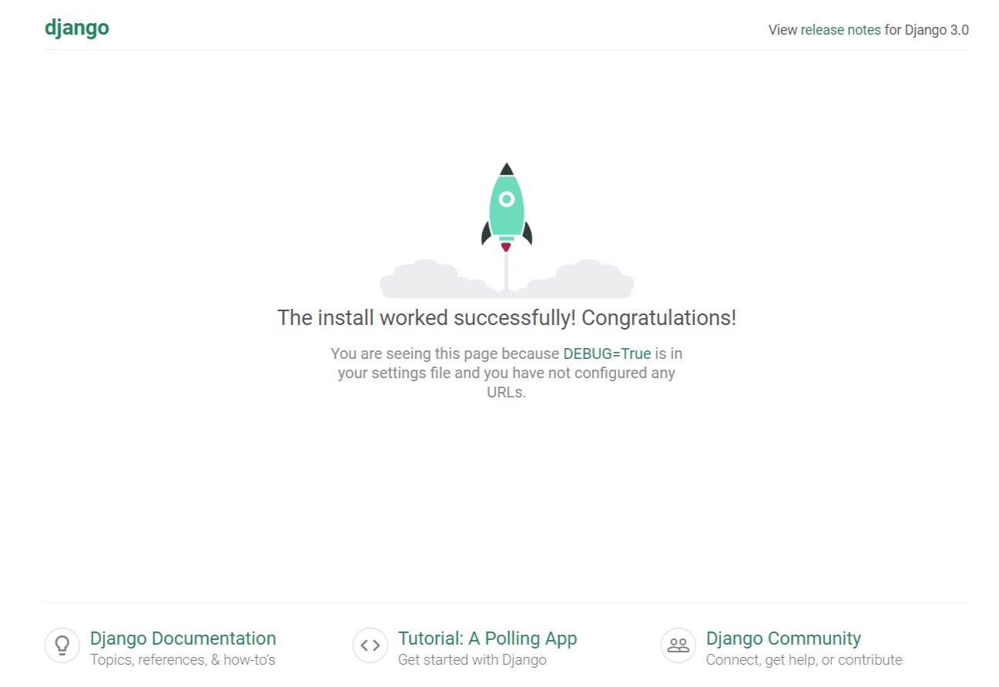
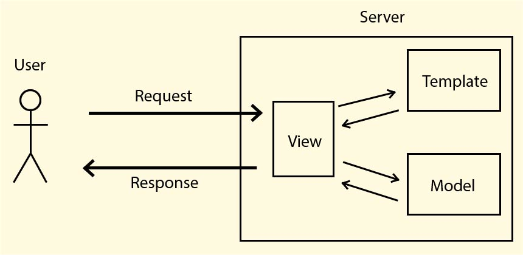
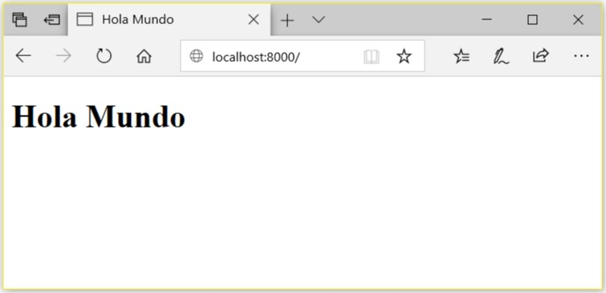

Django is a high-level web framework that enables fast application development following the [MTV](https://uniwebsidad.com/libros/django-1-0/capitulo-5/el-patron-de-diseno-mtv) design pattern. Developed and maintained by excellent community programmers, Django takes care of much of the hassle of web development, so you can write your app without inventing the wheel in a very elegant and simple way. "Simple" is the fundamental word I would say.

> Django's fundamental goal is to facilitate the creation of complex websites. Django emphasizes reuse, component connectivity and extensibility, rapid development, and the Don't Repeat Yourself (DRY) principle.

- [Goals](#goals)
- [Environment](#environment)
  - [Python installation](#python-installation)
  - [Virtual Environment Creation](#virtual-environment-creation)
  - [Django installation](#django-installation)
  - [Choosing an IDE](#choosing-an-ide)
- [Creating the project](#creating-the-project)
  - [Saving dependencies](#saving-dependencies)
- [Creating the first App](#creating-the-first-app)
  - [Installing the app](#installing-the-app)
  - [First page](#first-page)

## Goals

Everything must have a goal, right? Well, ours, as you can deduce, is to create a project with Django. But, about what? A classic! We will make a **Todo** application. Yes, one of those where you put tasks you want to do and mark them as *Done* when you finish them.

It will have super powers, but let's not talk about it now, we will see more articles where we will detail the idea better. For now, we are going to focus on installing Django and creating the basic structure. Exactly what we have to do every time we start any project with Django.

## Environment

At the beginning I said that Django is a framework written in Python and Python is an interpreted language, therefore, we need an interpreter installed on our computer to be able to execute any code written in Python. So the first thing we will do is install Python if we haven't already.

### Python installation

If you have partially done your homework, you will have seen that there are two “main versions”: 2 and 3. Since January 1 of this year (2020) the [python creators stopped supporting version 2](https://www.python.org/doc/sunset-python-2/), so unless you have a legacy system or really have no choice, always use version 3!

Download the latest version of Python from the [official page](https://www.python.org/downloads/).

In the case you use Windows, the installation process is very straightforward, the typical "next", "next"... Just keep in mind in the first window, check the option **Add Python 3.8 to PATH** otherwise you will have to do it manual later.

If you use Linux you can consult [this link](https://realpython.com/installing-python/) to help you in the installation. Check first if it is not installed, in many distributions it comes by default. You can check it with `python --version` or `python3 --version`.

### Virtual Environment Creation

I have previously written [an article](/virtualenv-python/) where I explain what we use virtual environments for, as well as the process of installing and creating them.

If you do not know what virtual environments are or how to install them, I recommend that you first read the article that I mentioned. **I recommend that you do not continue until you have installed, created and activated a virtual environment.**

### Django installation

If we already have the virtual environment installed, we can proceed to install Django. It is VERY simple: we only have to run a command on our console. So we open the console and run the following command (don't do it yet):

```bash
pip install django
```

With the previous command we will have installed Django in our environment, in this way we will have installed the latest published version of Django, isn't that good? Yes, but there is almost always a *"but"*, and here is one that we have to consider.

LTS, have you heard, seen or know what those acronyms mean? Well it means *"Long Time Support"*, and it is a surname given to not only to Django, but most of the software versions that the creators plan to give it long-term support. And, therefore, the community will create "solutions" that have the greatest possible compatibility with these versions. Why with these types of versions and not with all? Well, the other versions usually only have a few months of support while the LTS have years, so they are more stable... theoretically 😅.

In the case that matters to us right now: Django. The support period for non-LTS versions is approximately 1 year and 3 months, while the LTS period is 3 years. The Django development team is committed to releasing LTS versions every 2 years according to the official website. The latest LTS version is 2.2 with support until April 2022.

For compatibility reasons it is a good idea to keep the latest LTS version, but in terms of security, it is best to keep the latest version. So unless you need some packages that don't support the latest versions of Django, install the latest one. Applications are like cars, you have to maintain them regularly, so you have to keep them updated.

If you need to install a specific version of Django, for example: the latest LTS version (at the time of writing this article is 2.2) we can do it as follows:

```bash
pip install django==2.2
```

As you can be deduce, to install a specific version is done specifying the version in this way `<package> == <version>`.

### Choosing an IDE

Always a good IDE is great for speeding up the development process and developer experience (DX). To create an application with Django we can do it from the notepad or any other text editor, but why waste life 🤔. According to my tastes [Pycharm](https://www.jetbrains.com/pycharm) must be at the first place in the IDEs for development in Python and for “transitivity”, in Django 😁. Pycharm has excellent support for Python, there is no doubt about that. But in the case of Django, only Pycharm Professional has good support (very good) not being like this in the free version for the community. Although the professional version is very good, [it is not cheap](https://www.jetbrains.com/pycharm/buy), but for anyone who can buy it, I recommend it, I don't think you will regret it.

Another “IDE” is [Visual Studio Code](https://code.visualstudio.com/), very good and free, although you have to install some extensions to give it a little of *super powers* if we don't want to go crazy. Other good choices are: [Atom](https://atom.io/), [Sublime Text](https://www.sublimetext.com/), [Visual Studio](https://visualstudio.microsoft.com/) which brings excellent support for Python and Django as well, among others.

Choosing an IDE is complex and depends a lot on your tastes and needs. My recommendation? Use several until you find one that you are comfortable with.


## Creating the project

The time for true fun has come! At this point we already have our environment ready: we have Python installed, a virtual environment activated, Django installed and an IDE ready to write code.

To create our project, we need to open a console and move with `cd` to the directory where we want to create the project. Then we run the command `django-admin startproject todo_project` to create it. This will have created a directory `todo_project` which is the name that I gave to the project, but you can call it whatever you want, although I recommend not using strange characters, there may be some problems in integrations with other tools/softwares with which you can integrate it in the future. The `todo_project` directory will have the following structure:

```sln
manage.py
todo_project
    __init__.py
    settings.py
    urls.py
    asgi.py
    wsgi.py
```

These files are:
- **manage.py**: A command line utility that allows you to interact with this project.
- **todo_project**: In this directory are the main configuration files of the project. The name of this directory varies depending on the name of the project.
- **__init__.py**: An empty file indicating that this directory should be considered a [Python package](https://docs.python.org/3/tutorial/modules.html#tut-packages).
- **settings.py**: All the project's settings and configurations are stored in this file.
- **urls.py**: This is where we declare all the URLs of the project. Later we will see it in action 😉.
- **asgi.py** and **wsgi.py**: These files are the entry points for the [ASGI](https://readthedocs.org/projects/asgi/downloads/pdf/latest/) or [WSGI](https://en.wikipedia.org/wiki/Web_Server_Gateway_Interface) servers may serve the project.

We can verify that the project works by starting the development server that has Django included, which although it is not prepared to work in a production environment, it is very useful to us during the development of the project. To start the project, run the following command:

```bash
python manage.py runserver
```

When opening the URL `http://localhost:8000` in the browser, we will get a view like the following, indicating that the creation of the project was successful.



Well, we already created our project!

### Saving dependencies

Saving project dependencies is important. Usually in any project you can have several dozen dependencies, or perhaps more. So if you need to copy the project to a teammate, or deploy it to another computer, or simply reinstall your computer and later you need to install them again, you will need an easy way to install them all and memorize all the packages you have installed will only work if it is this introductory project where we have only installed Django.

In python the `freeze` command from `pip` is used to list all packages installed in the current environment (here's another important point of having a virtual environment). Therefore we can use the `pip freeze` command and redirect the flow to a file and thus save all dependencies. It would be this way:

```bash
pip freeze > requirements.txt
```

Now in the `requirements.txt` file there will be a list with all the dependencies that the project needs. If we see the contents of the file we will notice that there are more packages than we installed, this is because here all the dependencies of our packages are listed:

```yaml{2}
asgiref == 3.2.7
Django == 3.0.5
pytz == 2019.3
sqlparse == 0.3.1
```

If we want to install all the dependencies in the future, just activate the virtual environment and execute the command `pip install -r requirements.txt`.

## Creating the first App

When I started with Django one of the first questions I asked myself was: What is the difference between a project and an app? In my head "an app is the result of doing a project."

In Django, a project is the entire website, with all its parts. An app is a module within the project. It is self-supporting and should have no dependencies with the other applications in the project, so in theory you could copy and paste it in another project without any modification to reuse parts of one project in others. Although to do the latter you have to follow certain rules so that the apps are as reusable as possible, but it may not be possible some times, or necessary due the project requirements.

Known the difference between a project and an app, we are going to create our first app by executing the following command:

```bash
python manage.py startapp todo
```

After executing the above command, inside the project directory there will be a new directory with the name `todo`, which was the one I chose for this app, but you can call it whatever you want. This directory will have the following structure:

```
todo
  migrations/
    __init__.py
  __init__.py
  admin.py
  apps.py
  models.py
  tests.py
  urls.py
  views.py
```

In the app structure the files mean:
- **__init__.py**: Both files indicate that the directory they are in are Python packages.
- **migrations**: All migrations generated from our model will be stored in this directory. Migrations are the mechanism that Django uses to keep the structure (or data) of the database up to date.
- **admin.py**: Django has a built-in administration panel that is automatically generated with very little code and allows you to do the [CRUD](https://wikipedia.org/wiki/CRUD) of our model in a very simple and elegant way. The necessary mechanisms to make this panel work must be located in this file.
- **apps.py**: This file is created to help the user to include any [app settings](https://docs.djangoproject.com/en/3.0/ref/applications/#application-configuration) . With this, you can configure some of the application's attributes.
- **models.py**: Here is where models of the Database are stored.
- **tests.py**: This file stores the tests of the application.
- **urls.py**: Previously we had seen a file with the same name, but at the project level. In this case, this file store all the path but at app level.
- **views.py**: The *views* are stored in this file. As I mentioned at the beginning, Django is a framework that follows the MTV pattern, it is very similar to MVC with some differences. We could make an analogy between Django Views with Controllers in another MVC framework. The differences are minimal.

### Installing the app

Every time a new application is created or added, it must be installed in the project. To install an application we must open the project configuration file located in `<project_name>/settings.py`. In the list of installed apps `INSTALLED_APPS` the name of the application that we want to install or the path to the class of application configurations must be added as follows:

```py {10}
INSTALLED_APPS = [
  'django.contrib.admin',
  'django.contrib.auth',
  'django.contrib.contenttypes',
  'django.contrib.sessions',
  'django.contrib.messages',
  'django.contrib.staticfiles',
  
  # new apps
  'todo'
]
```

### First page

There is no programmer that doesn't start doing a **"Hello world"**, so that's what we're going to do now. We will create a simple page that will only show the famous message. In Django whenever we are going to create a new page, we will have to do it in 3 steps (not necessarily in the same order):

- Create the template, could be a HTML, JSON, XML or any other template type
- Create a view that receives the request and sends a response (View)
- Create the route where the page will be displayed

To better understand how Django works, let's analyze the following image:



When a user makes a request to the server, it is served by a view. The views in Django are in charge of building the response to the user, a response that when finished processing everything it needs, will send to the user. Every request must have an answer!

The views can, if necessary, interact with the model (Database) to search, insert, edit or delete data. The information that you can request from the Database is commonly sent to the templates in order to display it later. Finally, the views must respond to the user.

If you understood how the Request/Response model works in Django, let's do the first step to create a page: create the template.

All templates must be stored inside the `templates` directory in the app (must be created if it doesn't exist, and it won't at the beginning), therefore, we will create a file inside with the name `hello.html` with the following content:

```django
<!DOCTYPE html>
<html lang="en">
<head>
    <title>Hello World</title>
</head>
<body>
    <h1>Hello World</h1>
</body>
</html>
```

The next step is to create the view that will receive the request and send the HTML document created above as a response. There are two ways to create a view: function-based or class-based. Let's see how they are implemented:

```py{6, 12}
from django.shortcuts import render
from django.views import View

# function based view
def hello_page(request):
  if request.method == 'GET':
    return render(request, 'hello.html')

# class based view
class HelloView(View):
    
  def get(self, request):
    return render(request, 'hello.html')
```

Many developers prefer function-based views (FBV), over all those old-schools guys because, in the first versions of Django, there were no class-based views (CBV). Each developer can take a different path, in my case I prefer class-based views since I like a lot Object Oriented Programming, in addition I finding them simpler, they save a lot of code and are clearer to me. In this tutorial and throughout my blog, you will always see class-based views, but that doesn't mean you have to create them that way, you can take your own path if you want and create function-based views.

Now let's understand how the views we just saw work. Both views will return a response only when called by the HTTP verb **GET**, in the case of FBV this is specified by checking if the request was sent by GET method (`request.method == 'GET'`); In the case of CBV, by inheriting from `View` we can override the methods with the name of the HTTP verb for which we want to respond. In CBV there is a method for each verb. Django creates an object of type `HttpRequest` with all the request information that is always accessible in the first parameter of the views regardless of the verb being used.

Views should always return a response of type `HttpResponse`, otherwise Django will raise an exception of type `ValueError` if `None` is returned or other exceptions like `AttributeError` or `NameError` depending on the value that is returned.

In the case of the previous views, a shortcut called `render` is used, which allows returning a response from a document (html, json, js, css, etc) located in the `templates` directory. This shortcut will be an excellent weapon to avoid having to do repetitive work that could cause errors. Thanks Django! Although `render` has several parameters, for now we will only see the two that we use: the first is the request made by the user and the second is the address of the document that we want to render. This address must always be relative to the app's `templates` directory.

The last step to be able to see the great "Hello World" in the browser, is to create a path for our page. To create the path, we will first create a `urls.py` file in our app with the following content:

```py {6}
from django.urls import path

from todo.views import HelloView, hello_page

urlpatterns = [
    path('', HelloView.as_view(), name='hello'),
]
```

Every time a new page is created in this app, the path must be added to the `urlpatterns` list in this file. The path will be created by invoking the `path` function, where the first parameter is the address of the path, which in this case is the root, so we put an empty string. The second parameter is the view that will take care of the requests that are sent by that route, if the view is a CBV, the method `as_view` must be called; if it is a FBV, just put the name of the function, for example: `hello_page`. The third parameter is the name of the route. The name of the route must be unique and it will be with which we will refer to this route in other parts of the app in the future.

With the file `todo_project/todo/urls.py` we configure all the paths of the `todo` app. Now we have to add the routes of this app to the routes of the project. Remember when we saw the files that were when creating the project? Well, there was one that was also called `urls.py`, as you could be assumed, that's where the routes are configured at the project level. To add the application routes to the project we have to put `path('', include('todo.urls'))` in the list of project routes, it would look like this:

```py {7}
from django.contrib import admin
from django.urls import path, include

urlpatterns = [
  path ('admin/', admin.site.urls),
  # all app routes
  path ('', include ('todo.urls'))
]
```

Similar to what we did before huh? The only difference is that, instead of using a view in the second parameter, we now use the `include` function which helps us include all the paths of an app (among other things 😉). As a parameter to `include` the path to the app's `urls` file is passed, but instead of slashes we use periods.

Now we just have to start the development server `python manage.py runserver` and open the project in a [browser](http://localhost:8000/) and boom! No, it does not explode, there we have our "Hello World"



You can clone the project from [GitHub](https://github.com/cabyas/Todo)
